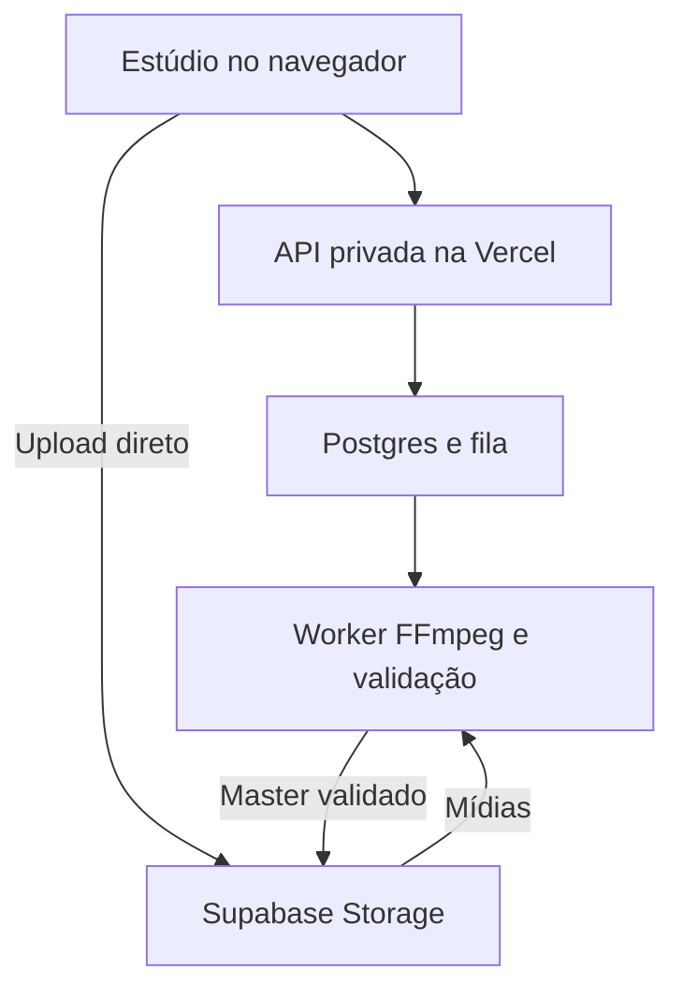

# Estúdio de Vídeo - Mapeamento e arquitetura própria

Mapeamento técnico e funcional para o Caçadores de Nichos

Versão 1.0 | 23 de setembro de 2026 | Documento de planejamento e critérios de implementação

> Nota de integração de COLAB-001: este mapa preserva a auditoria feita sobre `ff17c95`. A plataforma recebeu posteriormente Mission Control, Quota Intelligence e Universe, incorporados durante a preparação do protocolo colaborativo. Na retomada, a base avançou até `69dd27e`, incluindo suporte a hospedagem própria com Docker e novas camadas do Universe. Antes de implementar o M0, reconferir a decisão de hospedagem, autenticação, tipos, jobs, retenção e pontos de UI contra a `master` atual. O inventário do AutoEditor permanece vinculado ao commit indicado abaixo; a descrição da plataforma é um retrato da base auditada, não uma nova auditoria dos módulos posteriores.

**Objetivo:** construir um estúdio próprio dentro da infraestrutura do projeto, conectado à pesquisa, aos roteiros e à gestão de canais. O AutoEditor serve como referência funcional; este documento especifica uma implementação independente.

**Conteúdo:** 54 recursos auditados, 16 melhorias propostas, arquitetura, contratos de dados, fases de entrega e 17 grupos de critérios de aceite.

**Decisão recomendada:** manter Next.js/Vercel para interface e API, Supabase para dados, arquivos e fila, e adicionar um worker de vídeo sob sua conta. A primeira entrega deve atravessar o fluxo completo de um roteiro revisado até um MP4 validado, com poucas ferramentas de edição e resultados consistentes.

A recomendação anterior de começar com exportação apenas no navegador priorizava um protótipo barato. Para o objetivo agora definido - produção confiável e redução de retrabalho - o desenho passa a ter renderização final no worker desde o primeiro fluxo completo. Exportar no navegador permanece uma opção posterior.

## 1. Base verificada e limites desta auditoria

| Base | Versão analisada | Evidência |
| --- | --- | --- |
| AutoEditor | Branch main, commit 894439344707c6f4ce326b257f05513b7092675d. | Clone do repositório e leitura de UI, bibliotecas, servidor e testes. |
| Caçadores de Nichos | Branch master, commit ff17c95baba26ef058e94d947aabcf1ab96fd8d8. | Código, AGENTS.md, schema e documentação operacional. |
| Verificação executada | 8 verificações pontuais, com 11 observações registradas. | P01-P08: funções isoladas e inspeção do caminho de dados. |
| Verificação não executada | Não houve instalação completa, navegação interativa, renderização audiovisual nem chamadas pagas. | Os achados de código e cálculos não equivalem a homologação dos aplicativos. |
| Infraestrutura real | Configuração de produção, planos, quotas, região e credenciais não foram inspecionados. | Vercel/Supabase são a base indicada pelo projeto; estado remoto precisa de confirmação técnica. |

A documentação atual ainda afirma que o GitHub não foi publicado, embora o repositório já exista. Isso demonstra que os textos de estado estão parcialmente desatualizados. Para capacidades, este mapa prioriza o código; para provisionamento real, mantém o estado como não verificado. [C06]

A licença do AutoEditor declara uso não comercial e exige autorização escrita para uso comercial do código. O plano aqui não importa seus componentes, estilos, fontes, sons ou marcas. Bibliotecas de terceiros do nosso estúdio também terão suas licenças registradas antes da adoção. [A26]

## 2. Achados que afetam a arquitetura

| Achado | O que foi constatado | Regra para nossa implementação |
| --- | --- | --- |
| F01 Resolução vertical | P05: a função pickRenderProfile transforma 1080x1920 em 608x1080. O teste simulou codecs disponíveis; não produziu um MP4. | O perfil exibido e o arquivo final devem ter dimensões iguais; qualquer redução precisa de escolha explícita. Q10. |
| F02 Duração segmentada | P06: 60 cenas de 5 s mantêm 300 s; 61 cenas de 5 s com fades de 0,4 s geram plano de 281,4 s, para timeline de 305 s. | Segmentar não pode recalcular os tempos editoriais nem remover 23,6 s. Q06/Q11. |
| F03 Legendas divergentes | P04: navegador define 8 estilos, servidor 3. Fonte e posição escolhidas também não chegam ao render FFmpeg. | Uma capacidade só é oferecida após prova de exportação equivalente. Q13. |
| F04 Fades ausentes | P08: fadeIn/fadeOut existem na UI e na prévia, mas não são lidos pelo renderer WebCodecs. | Verificar cada controle até o arquivo final; controles sem efeito são falha de aceite. Q08/Q09. |
| F05 Efeitos/SFX ausentes | P07: adicionar efeitos/SFX ao spec não muda o plano FFmpeg. O cliente também não envia esses campos. | Manifest validado e catálogo de capacidades impedem descarte silencioso. Q08/Q09. |
| F06 Áudio incompleto | Falhas de áudio no WebCodecs podem continuar como vídeo sem som; alguns caminhos apenas registram ou descartam a fonte. | Se a revisão exige narração, áudio ausente invalida a entrega. Silêncio proposital é uma configuração. Q09. |
| F07 Histórico parcial | Undo/redo inclui slots e transições; outros ajustes vivem fora desse histórico. | Todas as alterações do documento entram no histórico e nas versões. Q07. |
| F08 Salvamento opaco | Exceções de IndexedDB/autosave são capturadas sem informar falha ao usuário. | Não mostrar salvo sem confirmação remota; permitir recuperar alterações pendentes. Q01/Q02. |
| F09 Operação local | Servidor tem um job ativo, Map em memória, temporários e APIs sem autenticação de usuário. | Persistir jobs, vincular dono/revisão e recuperar após falha do processo. Q12/Q14. |
| F10 Testes desalinhados | Testes de segmentação usam starts sobrepostos; a timeline do frontend gera cenas contíguas. | Fixtures devem sair do contrato real do editor e chegar ao planejador/exportador. Q06/Q11. |

F01 e F02 são divergências reproduzidas em funções do código auditado. F03-F10 combinam leitura de implementação e verificações pontuais. Nenhum desses itens foi apresentado como observação de uma exportação real nesta sessão.

## 3. Mapa dos recursos existentes

**Como ler:** a coluna central descreve o AutoEditor no commit auditado. A coluna seguinte é proposta para o nosso produto. M0 é fundação técnica; M1 é a primeira entrega utilizável; M2 amplia edição; M3 adiciona IA; M4 trata escala. Q01-Q17 são critérios de aceite definidos na seção 10. IDs A/C/D remetem às fontes na seção 13.

### Projetos, importação e organização

| Recurso | Comportamento atual | Implementação própria e melhoria | Origem |
| --- | --- | --- | --- |
| R01 Projetos | Criar, listar por atualização, reabrir, renomear e excluir; miniatura, duração e contagem de clipes. | M1: projetos por canal/episódio, pesquisa, duplicação e arquivamento. Q01/Q04. | A20/A21 |
| R02 Salvamento | IndexedDB guarda estado e blobs separados; autosave após 1,2 s. Erros de gravação são capturados sem aviso. | M0/M1: autosave remoto com revisão esperada, estado salvo/pendente/falhou e recuperação local. Q01/Q02. | A01:553-601; A20 |
| R03 Armazenamento | Medidor de uso/quota do navegador e pedido de persistência; sem sincronização entre computadores. | M1: Storage privado, quotas por projeto, backup e restauração; cache local descartável. Q01/Q04. | A20/A21 |
| R04 Narração | Importa um arquivo de áudio; mede duração e extrai waveform. Áudio é obrigatório para abrir o editor montado. | M1: narração e modo duração manual; ingestão valida codec e presença de áudio. Q03/Q09. | A01:173-189,490; A06 |
| R05 Mídias | Importa imagens e vídeos em lote; cria miniaturas/posters. Aceitação por MIME do navegador não garante todo codec. | M1: upload com progresso, retomada e diagnóstico por arquivo; metadados verificados no worker. Q03. | A01:22-67,190-216 |
| R06 Nomes temporizados | Lê mm-ss, mm_ss, hh-mm-ss, segundos/mmss, milissegundos finais e sufixos do Flow. | M1: manter importação por timestamp como opção; cenas também aceitam mídia com qualquer nome. Q05. | A04; P02 |
| R07 Colisões | Na importação, um horário já existente recebe a nova mídia; nomes sem horário ficam fora da montagem. | M1: confirmação para substituir; escolher ordenar, inserir ou associar a cena. IDs próprios. Q05. | A01:202-212; A03 |
| R08 Duração | Timeline termina na duração da narração; último clipe preenche o restante. | M0: duração explícita em frames, sincronizada à narração quando escolhido; nenhum ajuste oculto. Q06. | A03; P01 |
| R09 Lacunas | Trechos iniciais vazios e clipes removidos tornam-se lacunas pretas; interface avisa. | M1: lacunas identificadas e confirmação antes de exportar; cor de fundo configurável. Q03/Q06. | A03/A15 |

### Timeline, prévia e edição

| Recurso | Comportamento atual | Implementação própria e melhoria | Origem |
| --- | --- | --- | --- |
| R10 Estrutura | Uma sequência visual, uma faixa de narração e marcadores SFX; sem camadas visuais livres. | M1: sequência de cenas estável; modelo admite faixas futuras, sem construir um editor multicamadas completo agora. Q06. | A02/A03 |
| R11 Reorganização | Posição deriva dos timestamps. Não encontrei arraste livre para reordenar, divisão ou duplicação de cenas. | M1: reordenar, dividir, duplicar e inserir; políticas explícitas para mover também legendas/SFX. Q05/Q06. | A01/A02 |
| R12 Duração por arraste | Arrastar fronteira altera a duração de dois clipes vizinhos; mínimo de 0,3 s, sem mudar o total. | M1: edição por frame e encaixe em fronteiras; manter ação de arraste como um único desfazer. Q06/Q07. | A02:104-147; A01:260-268 |
| R13 Corte de saída | Ajusta apenas o final exportado; mínimo de 1 s, com encaixe nas bordas. | M1: intervalo de exportação validado e visível; corte inicial como extensão posterior. Q06. | A02:69-103; A03 |
| R14 Reprodução | Prévia Canvas, play/pause, seek, waveform, régua e rolagem horizontal. | M1: prévia com proxies, indicador de carregamento e regiões de segurança. Q08/Q17. | A06/A02 |
| R15 Atalhos | Espaço reproduz; setas avançam/recuam 1 s ou 5 s com Shift; Home volta ao início; há atalhos de histórico. | M1: atalhos por frame/tempo, foco acessível e proteção quando digitando em campos. Q07/Q17. | A06:357-376; A01:399-409 |
| R16 Histórico | Undo/redo armazena slots e transições; volume, efeitos, legendas e SFX ficam em estados separados. | M0: histórico de todo o documento editável; versões salvas independentes da pilha de desfazer. Q07. | A01:90-117,166-169,315-350 |
| R17 Substituição | Troca imagem/vídeo mantendo posição; remoção deixa um espaço vazio. | M1: substituir preserva enquadramento quando compatível; avisar sobre duração/codec diferentes. Q05. | A05; A01:218-258 |
| R18 Trim de vídeo | Seleciona ponto inicial em passos de 0,05 s. Se faltar vídeo no modo trim, mantém o último quadro. | M1: trim em frames com política explícita: congelar, repetir ou deixar lacuna. Q06/Q08. | A05:161-223 |
| R19 Ajuste de velocidade | Fit acelera/desacelera o vídeo inteiro para a duração da cena; trim toca a 1x. | M1: velocidade visível e limitada; preservar pitch como opção testada e avisar sobre áudio incompatível. Q08/Q09. | A05; A01:710-859 |
| R20 Enquadramento | Mídia é centralizada mantendo proporção, com barras quando necessário; zoom é central. | M1: conter/preencher e ponto focal manual; presets 16:9/9:16 independentes. Q08/Q10. | A07:11-25; A14:190-207 |

### Transições, movimento e efeitos

| Recurso | Comportamento atual | Implementação própria e melhoria | Origem |
| --- | --- | --- | --- |
| R21 Catálogo de transições | 8 opções: nenhuma, crossfade, fade preto, wipe esquerda/direita, slide esquerda/direita e abertura circular. | M1: corte e crossfade confiáveis; M2: demais transições após validar paridade. Q08/Q11. | A07 |
| R22 Aplicação | Transição por corte, aplicar em todos e mistura aleatória evitando repetição consecutiva. | M2: presets por canal e seed persistente para misturas reproduzíveis; escolha permanece editável. Q08. | A07/A28 |
| R23 Tempo de transição | Controle global entre 0,15 e 1 s; navegador limita à duração do clipe corrente. FFmpeg tem lógica diferente. | M0: contrato único de duração/limites; não encurtar a timeline por aplicar transição. Q06/Q11. | A07/A14/A18 |
| R24 Movimento | Zoom in/out central, aplicar a todos ou alternar, intensidade de 2% a 20%. | M1: zoom com prévia e exportação consistentes; M2: pan e pontos de início/fim. Q08. | A08/A05 |
| R25 Fades | Painel oferece entrada/saída de 0 a 2 s. Prévia visual e FFmpeg aplicam; WebCodecs não lê esses valores. | M1: fade visual e de áudio com teste conjunto; recurso só aparece quando exportável. Q08/Q09. | A08; A06:242-250; A14/A18; P08 |
| R26 Efeitos | 12 efeitos além de nenhum: P&B, sépia, quente, frio, grain, noise, vinheta, glitch, VHS, light leak, neve e poeira. | M2: começar com ajustes reproduzíveis; avançados só após implementação e paridade. Q08. | A09 |
| R27 Escopo dos efeitos | Um efeito global e override por clipe, com intensidade. Não é uma pilha de múltiplos efeitos. | M2: parâmetros versionados e composição limitada; exportador declara o que suporta. Q08. | A05/A09/A14 |
| R28 Reprodutibilidade | Ruído usa textura inicializada com Math.random; parte das partículas usa função determinística. | M0/M2: seed, algoritmo e versão de render registrados; mesma revisão reproduz o mesmo resultado esperado. Q08/Q12. | A09:40-104 |

### Legendas e áudio

| Recurso | Comportamento atual | Implementação própria e melhoria | Origem |
| --- | --- | --- | --- |
| R29 Importar legendas | SRT/VTT e TXT com intervalos ou marcadores inline/por linha. Texto sem tempo é rejeitado. | M1: importação com diagnóstico; M3: transcrição/alinhamento automático separado. Q13. | A10/A11; P03 |
| R30 Segmentação textual | Frases longas viram blocos menores; tempos internos são distribuídos proporcionalmente ao número de caracteres. | M1: editor de blocos com tempos; M3: alinhamento real por palavra quando disponível. Q13. | A10:194-244 |
| R31 Estilos | Navegador tem 8 estilos: classic, boxed, yellow, bar, shadow, bold, mint e cinema. FFmpeg tem apenas 3. | M1: um preset homologado; M2: ampliar catálogo só com equivalentes exportáveis. Q08/Q13. | A10/A19; P04 |
| R32 Fontes | Navegador oferece Default, Montserrat, Anton e Poppins; servidor usa apenas caption.ttf. | M1: fontes próprias/licenciadas, versão e hash fixos; mesma fonte na prévia e no worker. Q13. | A10:57-67; A19 |
| R33 Posição | Topo/meio/base e ajuste percentual de 0 a 100 no navegador; servidor ancora na base. | M1: posição normalizada com limites e áreas seguras por formato. Q10/Q13. | A11/A19 |
| R34 Tipografia | 3 tamanhos, ajuste fino de 3% a 10% da altura e entrelinha de 1 a 2,2. | M1: parâmetros explícitos e medição real da fonte para quebra de linha. Q13. | A11 |
| R35 Edição/exportação de texto | Legendas são queimadas no vídeo; UI substitui arquivo, mas não oferece editor de cada bloco nem exportação SRT. | M1: editar texto/tempo por bloco e exportar SRT; manter cue original para rastreabilidade. Q13. | A11/A15 |
| R36 Mixagem | Uma narração + áudio dos clipes + SFX. Volume dos clipes de 0 a 100%, padrão 50%. | M1: ganho por faixa; M2: música, ducking e normalização com alvo explícito. Q09. | A05/A14/A18 |
| R37 Sons incluídos | 6 sons: whoosh, swoosh, pop, ding, click e boom; também recebe uploads de áudio. | M2: biblioteca própria com origem/licença registradas; busca, tags e prévia. Q03/Q09. | A12/A13 |
| R38 Posicionar SFX | Selecionar som, clicar na faixa FX, arrastar marcador, mudar volume ou remover. | M2: duração, trim, fade e snap; undo/redo e exportação garantidos para cada evento. Q07/Q09. | A02:149-185; A06:576-606 |
| R39 Leitura de áudio | WAV pode ser lido em janelas; outros formatos decodificados e transferidos para OPFS quando possível. | M0: worker normaliza áudio para base comum; prévia usa arquivo leve e waveform pré-calculada. Q03/Q09/Q17. | A23/A14 |
| R40 Falha de áudio | WebCodecs pode continuar sem áudio após falha. UI avisa em algumas rotas; falhas de decode também podem descartar fontes. | M0: narração obrigatória nunca some com status concluído; falha explicada e nova tentativa. Q09/Q12. | A14:341-360,394-411,640-669; A01:859-875 |

### Exportação e operação

| Recurso | Comportamento atual | Implementação própria e melhoria | Origem |
| --- | --- | --- | --- |
| R41 Formatos e FPS | UI oferece 1920x1080, 1080x1920 ou tamanho da mídia; 24/30 fps; qualidade full ou 720p. | M1: presets reais e verificáveis no arquivo: horizontal/vertical 1080p e 720p. Q10. | A15/A27 |
| R42 Vertical real | Cálculo do perfil WebCodecs limita altura a 1080: 1080x1920 passa a 608x1080 quando codec disponível. | M0: quantização por orientação, sem redução silenciosa; resolução final no resumo e na verificação. Q10. | A14:148-166; P05 |
| R43 Codecs | WebCodecs escolhe H.264; áudio AAC, fallback Opus no MP4 ou ausência de áudio. Capacidade é sondada. | M0/M1: master H.264/AAC homologado; alternativas devem ter nome e compatibilidade explícitos. Q09/Q10. | A14:65-168 |
| R44 Memória de saída | Desktop usa buffer em memória; mobile tenta MP4 fragmentado em OPFS, com fallback para memória. | M0: render final no worker; navegador faz prévia. Exportação local vira opção posterior com limites próprios. Q12/Q17. | A14:537-610 |
| R45 Decodificar clipes | Caminho MP4 via mp4box/WebCodecs e fallback com elemento de vídeo; pode carregar o arquivo inteiro em memória. | M1: probe de mídia, proxies e limites de recursos; suporte declarado por codec. Q03/Q17. | A22/A14 |
| R46 Progresso/cancelar | Percentual, tempo decorrido, estimativa e cancelamento; render local depende da aba/processo ativo. | M1: progresso por etapa e estado persistente; cancelar é terminal e libera recursos. Q12. | A15/A14/A17 |
| R47 Servidor alternativo | Express com FFmpeg nativo; detecta QSV/NVENC/AMF/MediaCodec e faz fallback para CPU. | M0: worker em container versionado, CPU como baseline; GPU somente após benchmark. Q12/Q17. | A17/A18 |
| R48 Fila | Um job ativo global, Map em memória e SSE/polling; reconecta enquanto o servidor ainda vive. | M0: fila persistente, lease, heartbeat, tentativas e idempotência por revisão. Q12/Q14. | A17:64-66,113-145; A16 |
| R49 Arquivo final | Servidor salva MP4 em pasta local; download limpa temporários e registro do job após entrega. | M1: saída no Storage privado, histórico de versões, download autenticado e retenção configurada. Q04/Q12. | A17:200-231,248-262 |
| R50 Render segmentado | Acima de 60 clipes com grafo, divide em partes. Fronteiras viram cortes; recalcula duração subtraindo transições. | M0: segmentação preserva coordenadas globais, inclusive transições de fronteira. Q06/Q11. | A18:241-392; P06 |
| R51 Paridade FFmpeg | Cliente não encaminha efeitos visuais, SFX, fonte ou posição de legenda; backend não os implementa integralmente. | M0: manifest único e catálogo de capacidades; recurso sem implementação não passa no preflight. Q08/Q09/Q13. | A16:114-128; A18/A19; P07 |
| R52 Exposição do servidor | Endpoints locais sem autenticação; upload multer sem limites explícitos; jobs sem dono persistente. | M0: autenticação em todas as operações, autorização por workspace, quotas e validação do manifest. Q03/Q14. | A17 |
| R53 Distribuição | Frontend Next 14/React 18 com export estático; scripts de empacotamento Windows, macOS e Android/Termux. | Não portar empacotadores para a plataforma web; preservar Next 16/React 19 e TypeScript atuais. | A25/A29; C08 |
| R54 Testes existentes | Testes de parsing, timeline, dimensões, transições e plano FFmpeg; não cobrem toda a paridade entre motores. | M0: testes de contrato e saída real. Reproduzir regressões com imagens/áudios sintéticos próprios. Q06-Q17. | A24; lib/__tests__ |

## 4. Melhorias que trazem valor para a sua plataforma

| Melhoria | Resultado desejado | Etapa | Aceite |
| --- | --- | --- | --- |
| E01 Projeto ligado ao roteiro | Criar episódio a partir de uma revisão do roteiro e vinculá-lo ao canal de produção correto. Diferenciar canal analisado de canal que você administra. | M1 | Q01/Q15 |
| E02 Storyboard | Dividir roteiro em cenas com texto, intenção visual, mídia, narração e status. Toda sugestão continua editável. | M1 manual; M3 IA | Q05/Q15 |
| E03 Importação tolerante | Receber mídias com qualquer nome, associar em lote e manter importação por timestamp para arquivos do fluxo atual. | M1 | Q03/Q05 |
| E04 Versionamento integral | Desfazer todas as mudanças, duplicar versões e reproduzir exatamente a revisão enviada para render. | M0/M1 | Q02/Q07/Q12 |
| E05 Edição independente da narração | Definir duração manual ou guiada por voz; trocar narração com relatório das cenas afetadas. | M1 | Q06/Q15 |
| E06 Formatos por canal | Presets horizontais/verticais, crop, ponto focal, áreas seguras e identidade visual própria. | M1/M2 | Q08/Q10 |
| E07 Legendagem revisável | Editar blocos e tempos, exportar SRT e usar a mesma fonte e layout na prévia aprovada e no MP4. | M1 | Q13 |
| E08 Voz gerada | TTS em inglês com voiceId, versão, trecho e custo registrados; regenerar só o trecho escolhido. | M3 | Q09/Q16 |
| E09 Transcrição e alinhamento | Gerar tempos a partir do áudio real; revisar baixa confiança. Texto do roteiro não substitui alinhamento. | M3 | Q13/Q16 |
| E10 Imagens e clipes gerados | Provedores substituíveis, prompts por cena, custo previsto, revisão humana e reutilização de ativos. | M3 | Q03/Q16 |
| E11 Música e inteligibilidade | Trilhas separadas, redução de música durante a fala, fades e normalização medidos. | M2 | Q09 |
| E12 Templates por canal | Salvar tipografia, cores, proporção, legendas, transições e tratamento de áudio; fixar versão do template. | M2 | Q08/Q13/Q15 |
| E13 Render verificável | Fila, retomada, falha explicada, resolução real, duração correta e áudio obrigatório checados antes da entrega. | M0/M1 | Q10/Q11/Q12 |
| E14 Biblioteca com origem | Checksum, metadados, fonte/licença, status de validação e referências de uso; eliminar uploads repetidos sem cruzar workspaces. | M1/M2 | Q03/Q04/Q14 |
| E15 Custos e operação | Tempo de render, fila, uso de disco, custo por episódio, limites diários e limpeza de temporários. | M0/M1; refinamento M4 | Q12/Q16/Q17 |
| E16 Contas e escala | IDs de workspace desde o começo; login multiusuário, papéis, colaboração e escalonamento entram quando o produto exigir. | Modelo M0; produto M4 | Q14/Q17 |

Publicação automática no YouTube, colaboração simultânea, editor multicamadas geral, 4K, 60 fps, motion tracking e edição multicâmera ficam fora do primeiro escopo. Sua futura entrada depende de demanda e testes próprios; o modelo não deve impedir a expansão.

## 5. Encaixe na infraestrutura existente

| Componente atual | O que existe no código | Encaixe do estúdio |
| --- | --- | --- |
| Next.js/React | Next 16.3.5, React 19.3.0 e TypeScript; dashboard com módulos editoriais. [C01/C08] | Nova rota /studio com carregamento sob demanda; domínio de edição separado do radar. Manter as versões do projeto. |
| Roteiros | Script contém título, conteúdo, channelId, opportunityId e status draft. [C02] | Introduzir revisão de roteiro para produção, status de revisão humana e storyboard; não tratar draft como pronto. |
| Gestão de canais | ManagedChannel representa canais do portfólio; Channel é referência analisada. [C02] | Usar managed_channel_id para produção e source_channel_id para referência. Nunca misturar os identificadores. |
| Login | Operador único, cookie assinado; mutações verificam sessão e Origin. [C03/C07] | Reaproveitar sessão atual. API resolve principal/workspace no servidor; modelo admite migração para contas depois. |
| Supabase | Persistência via servidor/service_role, tabelas com RLS e acesso público revogado. [C04/C07] | Novas tabelas studio_* e buckets privados; nenhuma chave de serviço no navegador. |
| Jobs atuais | Análises compartilham exclusão global, lease de 15 min e limite diário de jobs. [C04/C05/C07] | Fila de render própria, sem usar o bloqueio global do radar nem limitar vídeo pelo orçamento de análise. |
| Retenção | prune_radar_data remove radar_scripts e parte dos dados de pesquisa após 30 dias. [C04] | Conteúdo autoral de produção e mídia têm ciclo de vida próprio. Referências externas continuam sujeitas às suas regras. |
| Chaves e provedores | Cofre prevê OpenAI e YouTube; os contratos atuais não cobrem TTS/ASR/vídeo. [C04/C07] | Adaptadores e permissões específicas para novas capacidades; não prometer geração porque a chave OpenAI já está cadastrada. |

O repositório permite projetar essa integração, mas não comprova que banco, Storage, quotas ou jobs estejam provisionados. A primeira etapa de execução inclui uma conferência autenticada do ambiente e uma migração revisável; nenhuma alteração remota foi realizada neste mapeamento.

## 6. Arquitetura recomendada

O sistema permanece no mesmo produto e sob suas contas. A infraestrutura recebe um componente de processamento de vídeo, o worker. Se hoje houver apenas Vercel e Supabase, esse executor ainda precisará ser provisionado.

| Camada | Responsabilidade | Limite de responsabilidade |
| --- | --- | --- |
| Editor no navegador | Storyboard, timeline, prévia com proxies, comandos de edição e cache de alterações. | Arquivo local/cache não é a única cópia; uma aba aberta não é necessária para concluir render remoto. |
| API Next.js na Vercel | Autenticar, autorizar, validar manifest, emitir upload assinado, salvar revisão, criar/cancelar jobs. | Recebe comandos e metadados pequenos. Não transporta todo o vídeo por /api/actions. |
| Supabase Postgres | Projetos, revisões, ativos, eventos, jobs, autorização e estado dos provedores. | Separar dados autorais de produção e dados temporários de pesquisa. |
| Supabase Storage | Originais, proxies, áudios, miniaturas, masters e arquivos SRT, em buckets privados. | Downloads e uploads com escopo e expiração. Não persistir blob: URLs ou URLs assinadas no manifest. |
| Fila durável | Entrega de tarefas de ingestão/render/IA, tentativas e visibilidade. | Proposta: Supabase Queues/pgmq, após confirmar extensão e permissões no projeto. Um worker consome as mensagens. |
| Worker de vídeo | FFprobe, normalização, geração de proxies, render FFmpeg, mixagem, validação e envio da saída. | Container e dependências fixos; quotas de CPU/RAM/disco, credencial restrita e logs sem segredos. |

**Upload direto:** as Functions da Vercel têm limite documentado de 4,5 MB para corpo de requisição/resposta. O navegador deve enviar vídeos diretamente ao Storage usando autorização emitida pela API. Supabase documenta uploads TUS retomáveis e token assinado no cabeçalho x-signature. Esta combinação se encaixa no login privado atual. [D01/D02]

**Fila:** Supabase Queues persiste mensagens no Postgres e oferece uma janela de visibilidade. Isso não torna uma chamada paga ou a gravação de um master automaticamente única: o worker precisa de idempotência e transações na conclusão. [D03]

### 6.1 Fluxo de operação

- 1. O operador escolhe um roteiro revisado ou cria um projeto vazio. A API registra a origem e a revisão.
- 2. A API reserva os ativos e emite permissões de upload para caminhos específicos. O navegador transfere diretamente ao Storage.
- 3. O worker verifica os bytes e os metadados, cria proxies e marca ativos como prontos ou rejeitados.
- 4. O operador monta as cenas. Autosave remoto usa controle de concorrência; a interface distingue pendente, salvo e falhou.
- 5. Exportar cria uma revisão imutável e executa preflight: assets, áudio, fontes, dimensões, recursos e quotas.
- 6. Job e mensagem de fila são criados em uma transação. A API retorna o identificador rapidamente.
- 7. O worker renova sua posse, renderiza a revisão, valida a saída e grava o master em caminho novo.
- 8. Só depois da validação e confirmação no banco o projeto mostra concluído. Download é autorizado por sessão e workspace.

### 6.2 Escolha do motor e paridade

**Motor final proposto: FFmpeg no worker.** Começar com imagens, clipes, corte, crossfade, zoom simples, um preset de legenda e mixagem básica. Fontes, resolução, FPS, versão do motor e parâmetros fazem parte da revisão exportada. A documentação oficial lista filtros úteis, mas sua mera existência não prova equivalência visual com Canvas. [D04]

A prévia interativa em Canvas/HTMLVideo usa o mesmo manifest e serve à edição rápida. Para aprovação visual precisa, oferecer um trecho de prévia renderizado pelo mesmo worker do master. Cada recurso tem uma matriz de capacidades e um teste comparando prévia/saída. Efeitos avançados de partículas ou glitch só entram após essa prova; compartilhar JSON não elimina diferenças entre motores.

Cortes segmentados conservam o relógio global. Se o worker renderizar trechos com sobreposição técnica, remove apenas os handles excedentes na composição final. Fronteiras com transição não podem virar cortes sem ação explícita. A duração exportada é uma propriedade da timeline, não uma soma recalculada por cada backend.

### 6.3 Organização proposta no repositório

| Área proposta | Conteúdo |
| --- | --- |
| src/app/studio/ | Rotas do estúdio, projetos e episódio; acesso privado. |
| src/components/studio/ | Timeline, storyboard, biblioteca, inspector, prévia e exportação. |
| src/lib/studio/ | Schemas, validação, comandos/undo, relógio, preflight e manifest versionado. |
| src/app/api/studio/ | Projetos, revisões, ativos, upload, jobs e downloads autenticados. |
| services/video-worker/ | Executor isolado; ingestão, FFprobe, render, validação e atualização dos jobs. |
| docs/studio/ e tests/studio/ | Contratos, decisões, fixtures próprias e critérios Q01-Q17. |

Esses caminhos são proposta de organização. O código da plataforma não foi alterado para criá-los. O serviço pode morar no mesmo repositório e ser implantado separadamente, preservando um único contrato compartilhado.

### Fluxo proposto dos componentes

## 7. Contratos que precisam existir antes da interface completa

### 7.1 Dados e propriedade

| Entidade proposta | Campos/contrato essencial | Regra |
| --- | --- | --- |
| studio_workspaces | id; principal da operação; política de retenção; limites. | Começar com um workspace do operador. Escopo é resolvido no servidor, nunca aceito como autoridade do cliente. |
| studio_projects | id; workspace_id; managed_channel_id; source_script_id; source_channel_id; título; idioma; current_revision; status. | IDs de canal de produção e referência são distintos; vínculos de pesquisa podem expirar sem apagar produção autoral. |
| studio_script_revisions | id; project_id; texto autoral; versão; hash; revisão factual; aprovação; autor/data. | Congelar o texto aprovado para produção. Mudança posterior não substitui silenciosamente a revisão usada. |
| studio_project_revisions | project_id; revision; schema_version; manifest JSON; hash; actor; created_at. | Revisão de exportação é imutável. Autosave usa a versão esperada e devolve conflito quando ela mudou. |
| studio_assets | id; workspace_id; tipo; object_key; checksum; tamanho; MIME real; metadados; origem; status. | Um ativo referencia bytes imutáveis; nome de arquivo é apenas um rótulo. Deduplicação limitada ao workspace. |
| studio_asset_variants | asset_id; tipo de proxy/áudio/waveform; object_key; source_hash; processor_version. | Cache pode ser regenerado. Troca de origem ou versão do processador invalida a variante. |
| studio_project_assets | project_id; asset_id; referência de uso. | Não apagar um original que ainda aparece em revisão/exportação protegida pela retenção. |
| studio_render_jobs | id; workspace_id; revision_id; perfil; manifest_hash; renderer_version; status; lease; attempt; progress; cancel_requested. | Cada resultado pertence a uma revisão e a uma tentativa válida, com atualização atômica. |
| studio_exports | job_id; output_key; checksum; probe JSON; validation_report; tamanho; created_at. | Só publicar o registro final após upload e validação. Arquivo temporário não equivale a master concluído. |
| studio_job_events / generation_jobs | etapa; código de erro; métricas; request_id do provedor; orçamento reservado/realizado. | Persistir transições; não guardar segredos nos logs. IA tem ciclo de vida separado do render. |

A tabela de revisões guarda o manifest como fonte de verdade da edição. As tabelas de ativos e jobs são relacionais. Não duplicar posições de timeline em tabelas e JSON mutáveis sem definir quem manda; o storyboard acompanha a revisão e seus IDs de cena.

### 7.2 Manifest de edição próprio

| Bloco | Campos mínimos | Invariante |
| --- | --- | --- |
| Identidade | schemaVersion; projectId; revisionId; workspaceId; sourceScriptRevisionId. | Exportar uma revisão conhecida; migrações explícitas de schemas antigos. |
| Saída | width; height; fpsNum/fpsDen; durationFrames; background; colorPolicy. | M1 suporta 24/1 e 30/1. Não usar duração em ponto flutuante acumulada como relógio principal. |
| Cena visual | id; assetId; startFrame; durationFrames; sourceIn; playbackRate; framing; motion. | Intervalos [início,fim) e IDs estáveis. Toda conversão de tempo usa posição absoluta e quantização única. |
| Faixas de áudio | id; assetId; startSample; sourceInSample; durationSamples; gain; fades; anchor. | Base de mixagem 48 kHz. Âncora pode ser absoluta ou ligada a cena; ambas têm semântica documentada. |
| Legendas | id; texto; startFrame/endFrame; styleId/version; fontAssetId; posição; idioma. | Texto renderizável, tempos válidos e referência de fonte imutável; fonte ausente reprova preflight. |
| Transições e efeitos | id; entradas; início; duração; parâmetros; seed; versão do algoritmo. | Transição não muda o tempo total. Efeito não suportado retorna erro de capacidade. |
| Proveniência | asset hashes; templateVersion; rendererVersion; geração/modelo quando houver. | Reproduzir a revisão, identificar origem e invalidar caches quando qualquer dependência mudar. |
| Políticas | allowSilent; requiredAudioTrackIds; gapPolicy; shortClipPolicy; exportRange. | Congelar quadro, repetir, omitir áudio ou deixar preto são decisões explícitas e registradas. |

Para 24 e 30 fps, uma base de áudio de 48 kHz permite fronteiras exatas de 2.000 e 1.600 amostras por frame. Se FPS fracionário for introduzido depois, o contrato deve conservar taxas racionais e calcular as posições absolutas; não arredondar cada trecho cumulativamente.

O perfil M1 de master é MP4 com H.264 e AAC, dimensões e FPS constantes e política de cor definida. Arquivos de entrada podem ter orientação, pixel aspect ratio e FPS variáveis; ingestão detecta isso e cria variantes compatíveis. A lista de codecs aceitos é um contrato testado, não um simples accept="video/*".

### 7.3 Semântica das edições

- **Relógio:** a narração pode fixar a duração, mas o modo manual também existe. A duração final é mostrada antes de exportar.
- **Mover mídia ou mover narrativa:** no primeiro fluxo com narração única, reordenar visuais mantém a voz fixa. Mover cena com voz/legenda exige vínculo explícito e confirmação da mudança de duração.
- **Dividir cena:** cria dois IDs, preserva os trechos de origem e distribui as referências locais. Duplicar reaproveita o asset; não duplica seus bytes nem dispara geração paga.
- **Trocar narração:** apresentar quais tempos, legendas e cenas serão afetados. Não reconstruir o projeto inteiro automaticamente.
- **Transição:** um evento na fronteira mistura as fontes dentro da janela definida e mantém os starts editoriais. Handles e falta de frames têm política explícita; não subtrair transições do total.
- **Trocar roteiro aprovado:** abrir nova revisão e marcar voz/legendas/cenas derivadas como potencialmente desatualizadas, sem destruir a versão anterior.
- **Falha de salvamento:** manter alterações locais pendentes, permitir tentar novamente e avisar antes de abandonar a edição.
- **Desfazer:** um gesto de arraste corresponde a uma ação; mudanças em parâmetros, legendas e áudio entram no mesmo histórico do documento.

### 7.4 API e acesso

| Operação proposta | Contrato | Comportamento necessário |
| --- | --- | --- |
| POST /api/studio/projects | Criar projeto vazio ou a partir de sourceScriptRevisionId. | Validar origem, sessão e escopo; retornar ID e revisão inicial. |
| GET /api/studio/projects/:id | Ler metadados, revisão atual e capacidades. | Validar sessão e autorização do objeto; GET não depende do Origin exigido pelo helper de mutação atual. |
| PUT /api/studio/projects/:id/revision | Enviar documento + expectedRevision. | Salvar atomicamente; conflito 409 devolve revisão remota, sem sobrescrever silenciosamente. |
| POST /api/studio/assets/upload-intent | Tipo, tamanho declarado e projeto; emitir token para objeto reservado. | Verificar limite e acesso antes de assinar. Tamanho/MIME reais serão conferidos após upload. |
| POST /api/studio/assets/:id/complete | Solicitar verificação/ingestão do ativo enviado. | Conferir objeto no Storage; não confiar apenas na declaração de upload concluído. |
| POST /api/studio/renders | revisionId, profileId e chave de idempotência. | Preflight, reserva de recursos e criação de job/fila em transação; resposta 202. |
| GET /api/studio/renders/:id | Estado, etapa, progresso, erros e saída validada. | Começar com polling curto e backoff; reabrir a página recupera o mesmo job. |
| POST /api/studio/renders/:id/cancel | Pedido de cancelamento. | Idempotente; impedir conclusão tardia de uma tentativa já cancelada. |
| GET /api/studio/exports/:id/download | Obter URL temporária de arquivo autorizado. | Verificar workspace e retenção; nunca expor bucket privado ou credencial de serviço. |

A sessão atual é própria do aplicativo e não cria automaticamente uma sessão Supabase Auth no navegador. A solução inicial usa API privada para autorizar e emitir tokens de upload específicos. Mutações reaproveitam a proteção de origem existente; leituras verificam sessão e acesso. Multiusuário exige autenticação e associação de membros reais, não uma senha única compartilhada.

### 7.5 Jobs, reexecução e cancelamento

Estados propostos: queued, preparing, rendering, validating, completed; com failed, retry_wait e cancelled. O estado público só avança para completed quando o arquivo foi enviado, lido/sondado e vinculado à revisão correta.

- Criar job e mensagem em uma transação evita registros sem execução e mensagens sem dono. Separar filas de ingestão, render e geração paga.
- O worker reclama uma tarefa por período renovável, emite heartbeat e usa token de tentativa. Outro worker pode recuperar tarefa expirada; um worker antigo não pode concluir a nova tentativa.
- Chave de idempotência inclui workspace, revisão imutável, perfil e versão do motor. Assets/fontes/seed fazem parte do hash da revisão. Pedido repetido consulta o job existente.
- O processamento pode ocorrer mais de uma vez após falhas; publicação do resultado deve ser idempotente. Nunca prometer execução exatamente uma vez de ponta a ponta.
- Cancelamento grava intenção, interrompe processos, remove temporários e impede publicação tardia. Se o job já terminou, a API informa o estado terminal real.
- Nova tentativa usa limite e backoff para falhas transitórias. Manifest inválido, codec não aceito ou arquivo corrompido requer correção, sem ciclo de retries.
- Na IA, gravar request_id/idempotency_key do provedor e reconciliar um resultado incerto antes de repetir a cobrança. Nem todo provedor permite interromper trabalho já iniciado.
- Banco e Storage não compartilham a mesma transação: gravar saída em caminho temporário/imutável, confirmar no banco e limpar órfãos por rotina com período de carência.

## 8. Escopo inicial e ordem de construção

O maior ganho vem de um fluxo completo e verificável. Construir primeiro todos os painéis de efeitos deixa os problemas de tempo, salvamento e exportação para o final. A sequência abaixo resolve essas dependências cedo.

| Marco | Entrega concreta | Dependência e saída obrigatória |
| --- | --- | --- |
| M0 Fundação | Conferência da infra, schemas, manifest, autorização, upload, fila e worker; fixtures de tempo/áudio/resolução. | Sem mídia real de clientes. Sair com upload/ingestão e um job que sobrevive ao fechamento da aba e reinício controlado do worker. |
| M1 Fluxo utilizável | Roteiro revisado -> projeto -> upload -> cenas -> cortes/crossfade/zoom -> narração -> legenda básica -> master validado. | Todos os critérios P0 passam; 16:9 e 9:16, autosave, conflitos, undo integral e reabertura em outra máquina. |
| M2 Qualidade editorial | Templates, crop/foco, mais legendas, música/ducking, SFX, transições e efeitos adicionais. | Cada ferramenta entra somente com contrato, teste de prévia/exportação e exemplo homologado. |
| M3 Automação com IA | Storyboard sugerido, TTS, ASR/alinhamento e imagens/clipes por cena; aprovação e custo por chamada. | Interfaces de provedores, controle de custos, credenciais adequadas e cancelamento/reconciliação definidos. |
| M4 Escala | Vários operadores, papéis, mais workers, paralelismo, cache avançado, colaboração ou publicação. | Dimensionar a partir de volume medido; não introduzir complexidade de SaaS antes da necessidade real. |

**Conjunto inicial de ferramentas:** uma sequência visual; narração importada; áudio dos clipes; cortes; crossfade; zoom central; substituir/dividir/duplicar mídia; duração manual ou guiada por áudio; legenda editável em um estilo; 16:9/9:16; exportação 24/30 fps. Mídias ficam em armazenamento privado e exportações têm histórico.

**Compatibilidade proposta para homologação inicial:** JPEG/PNG, MP4 H.264 e WAV/MP3. Outros contêineres e codecs, imagens animadas, HDR e transparência de vídeo entram com conversão/testes explícitos. PNG transparente recebe fundo definido no projeto. Fotos precisam ter orientação EXIF respeitada.

**Envelope proposto para medir, não promessa de capacidade:** projetos de até 20 minutos e 200 cenas, saída até 1080p/30 fps, um render ativo por worker e dois navegadores desktop atuais para edição completa. Limites finais de arquivo, duração, RAM e concorrência são configuráveis e dependem do benchmark. Celular começa com gestão/revisão, com edição completa condicionada aos testes.

## 9. Custos, capacidade e operação

| Fator | Como medir | Decisão decorrente |
| --- | --- | --- |
| Computação | Segundos de worker por minuto final; CPU/RAM/disco máximos; tipo de efeito e número de clipes. | Escolher tamanho do executor e concorrência depois do benchmark. GPU não é requisito automático. |
| Storage | GB de originais, proxies, áudio, versões e masters; dias de retenção. | Quotas por projeto e limpeza de derivados/órfãos; não excluir originais em uso. |
| Tráfego | Uploads, leituras pelo worker, previews e downloads finais. | Preferir proximidade de região entre banco/storage/worker e reutilização de proxies. |
| IA | Caracteres/tokens, segundos de áudio/vídeo, imagens, tentativas e chamadas sem resultado conhecido. | Reserva de orçamento por tarefa/projeto e aprovação quando exceder limite. |
| Operação | Tempo em fila, taxa de falhas, tentativas, jobs parados, variação entre versões do motor. | Alertas com jobId, revisionId e código de falha; painel de diagnóstico sem segredos. |

Exemplo aritmético, não estimativa de preço: 10 minutos a 8 Mb/s representam cerca de 600 MB de vídeo; AAC a 192 kb/s acrescenta cerca de 14,4 MB. Cem masters desse perfil passam de 60 GB, antes de originais e proxies. Qualidade variável altera esse tamanho. Não há preço mensal confiável sem volume, retenção e plano das suas contas.

O benchmark deve medir um vídeo curto de 60 s, um episódio de 10 min, um projeto de 20 min/200 cenas e cenas com mídia de celular. Registrar tempo, pico de RAM/disco, tamanho e validação audiovisual. O tempo total precisa incluir ingestão, fila, render, upload e validação, não só a codificação.

## 10. Critérios de aceite e testes para evitar retrabalho

P0 bloqueia a primeira entrega utilizável. P1 bloqueia a liberação da ferramenta a que se aplica. Os valores abaixo são metas propostas de homologação; desempenho ainda precisa ser medido no ambiente escolhido.

| ID | Prioridade | Resultado exigido |
| --- | --- | --- |
| Q01 Persistência | P0 | Criar projeto, inserir mídia e mudar timeline; aguardar confirmação remota; reabrir em outro navegador e verificar hashes, parâmetros e ativos. Falha de rede deve exibir pendente/falhou, nunca salvo. |
| Q02 Concorrência | P0 | Abrir a mesma revisão em duas abas; salvar A e depois B. B recebe conflito recuperável. Render de uma revisão anterior continua a usar exatamente a versão congelada. |
| Q03 Ingestão | P0 | Upload interrompido retoma; arquivo corrompido, MIME falso ou além do limite é rejeitado antes de pronto. Mídia ausente/lacuna bloqueia exportação ou pede confirmação conforme a política. |
| Q04 Acesso e retenção | P0 | Projeto e download são privados; exclusão/expiração não removem ativos ainda referenciados. Executar a limpeza do radar não apaga conteúdo autoral de produção. Testar restauração de backup, não apenas sua existência. |
| Q05 Operações de cena | P0 | Importar arquivos sem timestamps, ordenar, substituir, dividir e duplicar. IDs não colidem. Mover visuais com voz fixa mantém áudio; mover conteúdo vinculado respeita a política declarada. |
| Q06 Relógio/duração | P0 | Usar 60, 61, 130 e 200 cenas; clipes curtos, gaps, velocidade e corte final. Timeline e master devem diferir no máximo um frame. Regenerar o teste P06 com o contrato novo e exigir 305 s. |
| Q07 Histórico | P0 | Sequência de edições em cenas, volume, fades, legenda, efeitos e SFX: desfazer/refazer restaura o documento esperado. Drag gera uma ação; salvar versão não elimina possibilidade de recuperação. |
| Q08 Paridade visual | P0/P1 | Para cada recurso liberado, comparar frames em início/meio/fim e fronteiras. Testar enquadramento, zoom, efeito e legenda. Definir tolerância por recurso; para aprovação exata usar prévia do worker. |
| Q09 Áudio | P0/P1 | Verificar presença e decodificação da narração, sincronismo, trim, velocidade e mixagem. Forçar falha do encoder/entrada e impedir concluído com narração ausente. Ducking/loudness precisam de medição própria quando liberados. |
| Q10 Perfil real | P0 | FFprobe confirma 1920x1080, 1080x1920 e presets 720p, FPS, codecs e duração. Tocar o MP4 completo; o valor da UI deve corresponder ao arquivo. Nada de fallback silencioso para 608x1080. |
| Q11 Segmentação | P0 | Renderizar a mesma revisão com e sem segmentação e comparar duração, áudio, legendas e transições nas fronteiras. Não converter crossfade em corte por atingir um número de clipes. |
| Q12 Resiliência | P0 | Fechar aba, expirar sessão, reiniciar worker, interromper Storage, duplicar mensagem, cancelar e receber conclusão tardia. Recuperar job sem misturar tentativas ou publicar saída incompleta. |
| Q13 Legendas | P0/P1 | Testar SRT/VTT/TXT, Unicode, percentuais, acentos, linhas longas, fonte indisponível e texto na borda. Cue [início,fim) não duplica no limite. Posição/layout devem seguir o preset; SRT exportado reimporta corretamente. |
| Q14 Autorização | P0 | Trocar projectId/assetId/jobId/workspaceId na requisição deve negar acesso. Testar upload, render, cancelamento e download; tokens limitados ao objeto correto; segredo de serviço nunca sai ao cliente. |
| Q15 Integração editorial | P0 | Projeto vem do roteiro revisado e do canal de produção correto. Alterar roteiro marca derivados obsoletos; demo não usa dados/chamadas reais; referências externas conservam sua política de retenção. |
| Q16 IA e orçamento | P1/M3 | Pedido repetido não gera cobrança por retry cego; reconciliar timeout; orçamento excedido impede novas chamadas. Guardar versão de prompt/modelo/voz e permitir regenerar uma única cena. |
| Q17 Capacidade/usabilidade | P0/P1 | Testar envelope proposto, arquivo longo, múltiplos formatos e mídia VFR. Medir RAM/disco/latência; recursos de teclado e foco funcionam. Estabelecer limites de produção somente após os resultados. |

Métricas técnicas de áudio e imagem não substituem ouvir e assistir aos exemplos finais. Cada marco inclui uma revisão audiovisual de amostras representativas, além das verificações automáticas. Os testes atuais da plataforma - typecheck, testes e build - continuam como gate de integração, conforme AGENTS.md. [C10]

## 11. Decisões pendentes com defaults propostos

O planejamento está completo para iniciar especificação e prova técnica. O dimensionamento e a seleção de provedores dependem de dados operacionais que não estão no repositório. Os defaults abaixo permitem avançar sem tratá-los como preferências já aprovadas.

| Decisão | Default proposto | O que muda se for diferente |
| --- | --- | --- |
| Operação interna ou vários clientes? | Um operador/workspace, com modelo preparado para membros. | Vários clientes exigem autenticação individual, cobrança/quotas por conta e isolamento testado antes da liberação. |
| Duração e volume por dia? | Homologar até 20 min/200 cenas e um render por worker. | Vídeos longos ou grande volume alteram capacidade, fila, retenção e custos. |
| Editar no celular? | Desktop como ambiente de edição completa inicial. | Celular como requisito principal exige interface e orçamento de memória específicos desde M1. |
| Mídias prontas ou geração IA? | Importar mídias e voz em M1; IA por cena em M3. | Geração desde o primeiro dia acrescenta provedores, orçamento, alinhamento e revisão de resultados. |
| Onde roda o worker? | Executor em container sob sua conta, próximo ao Storage. | O provedor/região e limites precisam ser conferidos; não há worker identificado no repositório atual. |
| Orçamento e retenção? | Não cotados; limites configuráveis e medição obrigatória. | Mais histórico e masters aumentam disco/tráfego; apagar cedo demais compromete reedição. |
| Identidade visual? | Interface portuguesa com identidade do Caçadores; conteúdo em inglês. | Novos idiomas ou marcas entram por configuração versionada, sem alterar a regra atual por suposição. |

## 12. Registro das verificações realizadas

| Prova | Execução | Resultado |
| --- | --- | --- |
| P01 Timeline | Executadas buildTimeline e trimClips com mídias nos tempos 0/5/9, lacuna e corte em 7 s. | Ordenação, descarte de item sem horário, gap e corte final confirmados. |
| P02 Timestamp | Executado parser com 00-04-289_202608272310.png. | Resultado: 4,289 s. |
| P03 Legenda sem tempo | Executado parseTranscript com narração sem marcadores. | Retorna erro; não cria tempos automaticamente. |
| P04 Estilos | Carregadas as definições exportadas dos módulos de legenda. | 8 estilos no navegador; 3 no servidor. |
| P05 Perfil | Executada a função exata de seleção de dimensões, isolada, com sondas de codec simuladas como disponíveis. | 1920x1080 preservado; 1080x1920 e 720x1280 viram 608x1080. Não testa hardware nem MP4. |
| P06 Plano segmentado | Executado buildRenderPlan com 60/61 cenas contíguas de 5 s e transições de 0,4 s. | 60: graph, 300 s. 61: segmented, 281,4 s para entrada de 305 s. Nenhum vídeo foi renderizado. |
| P07 Efeitos/SFX | Comparado plano FFmpeg sem efeitos com plano contendo efeitos e evento sonoro. | Objetos do plano são iguais: campos não afetam a construção do plano. |
| P08 Fades | Inspeção do renderer WebCodecs, parâmetros de chamada e busca por fadeIn/fadeOut. | Campos ausentes do caminho de render, embora presentes em UI/prévia/FFmpeg. |

Ambiente de provas: Node 24.19.0. Para carregar o planejador sem instalar o servidor, a importação de ffmpeg-static foi substituída apenas em memória por um caminho local; seus módulos auxiliares foram importados por caminho absoluto. A função de planejamento permaneceu inalterada. Não foram executados os testes Vitest completos, o FFmpeg nem os aplicativos no navegador.

## 13. Fontes e rastreabilidade

As referências A e C usam commits fixos, para que mudanças futuras do GitHub não alterem a base deste mapa. As fontes D são documentação oficial consultada em 23/09/2026. Sua aplicação ao desenho do estúdio é uma recomendação de arquitetura, não uma confirmação de configuração das suas contas.

**A01** - [Página e coordenação do editor](https://github.com/codewithsiddique-04/autoeditor/blob/894439344707c6f4ce326b257f05513b7092675d/app/page.js)

**A02** - [Timeline e interações](https://github.com/codewithsiddique-04/autoeditor/blob/894439344707c6f4ce326b257f05513b7092675d/components/Timeline.js)

**A03** - [Modelo de timeline](https://github.com/codewithsiddique-04/autoeditor/blob/894439344707c6f4ce326b257f05513b7092675d/lib/timeline.js)

**A04** - [Parser dos nomes de arquivos](https://github.com/codewithsiddique-04/autoeditor/blob/894439344707c6f4ce326b257f05513b7092675d/lib/timestamp.js)

**A05** - [Inspector de clipes](https://github.com/codewithsiddique-04/autoeditor/blob/894439344707c6f4ce326b257f05513b7092675d/components/InspectorModal.js)

**A06** - [Prévia e atalhos](https://github.com/codewithsiddique-04/autoeditor/blob/894439344707c6f4ce326b257f05513b7092675d/components/Editor.js)

**A07** - [Transições](https://github.com/codewithsiddique-04/autoeditor/blob/894439344707c6f4ce326b257f05513b7092675d/lib/transitions.js)

**A08** - [Movimento e fades](https://github.com/codewithsiddique-04/autoeditor/blob/894439344707c6f4ce326b257f05513b7092675d/components/panels/MotionPanel.js)

**A09** - [Efeitos visuais](https://github.com/codewithsiddique-04/autoeditor/blob/894439344707c6f4ce326b257f05513b7092675d/lib/effects.js)

**A10** - [Legendas no navegador](https://github.com/codewithsiddique-04/autoeditor/blob/894439344707c6f4ce326b257f05513b7092675d/lib/captions.js)

**A11** - [Painel de legendas](https://github.com/codewithsiddique-04/autoeditor/blob/894439344707c6f4ce326b257f05513b7092675d/components/panels/CaptionsPanel.js)

**A12** - [SFX e biblioteca](https://github.com/codewithsiddique-04/autoeditor/blob/894439344707c6f4ce326b257f05513b7092675d/lib/sfx.js)

**A13** - [Painel de áudio](https://github.com/codewithsiddique-04/autoeditor/blob/894439344707c6f4ce326b257f05513b7092675d/components/panels/AudioPanel.js)

**A14** - [Exportação WebCodecs](https://github.com/codewithsiddique-04/autoeditor/blob/894439344707c6f4ce326b257f05513b7092675d/lib/webcodecsRender.js)

**A15** - [Perfil de saída](https://github.com/codewithsiddique-04/autoeditor/blob/894439344707c6f4ce326b257f05513b7092675d/components/panels/ExportPanel.js)

**A16** - [Cliente do servidor de render](https://github.com/codewithsiddique-04/autoeditor/blob/894439344707c6f4ce326b257f05513b7092675d/lib/serverRender.js)

**A17** - [Servidor local](https://github.com/codewithsiddique-04/autoeditor/blob/894439344707c6f4ce326b257f05513b7092675d/server/index.js)

**A18** - [Planejador FFmpeg](https://github.com/codewithsiddique-04/autoeditor/blob/894439344707c6f4ce326b257f05513b7092675d/server/render.js)

**A19** - [Legendas FFmpeg](https://github.com/codewithsiddique-04/autoeditor/blob/894439344707c6f4ce326b257f05513b7092675d/server/captions.js)

**A20** - [Persistência IndexedDB](https://github.com/codewithsiddique-04/autoeditor/blob/894439344707c6f4ce326b257f05513b7092675d/lib/projectStore.js)

**A21** - [Lista de projetos](https://github.com/codewithsiddique-04/autoeditor/blob/894439344707c6f4ce326b257f05513b7092675d/components/ProjectsHome.js)

**A22** - [Decodificação de vídeo](https://github.com/codewithsiddique-04/autoeditor/blob/894439344707c6f4ce326b257f05513b7092675d/lib/videoDecodeSource.js)

**A23** - [Leitura da narração](https://github.com/codewithsiddique-04/autoeditor/blob/894439344707c6f4ce326b257f05513b7092675d/lib/voiceSource.js)

**A24** - [Testes do servidor](https://github.com/codewithsiddique-04/autoeditor/blob/894439344707c6f4ce326b257f05513b7092675d/server/render.test.js)

**A25** - [Dependências do AutoEditor](https://github.com/codewithsiddique-04/autoeditor/blob/894439344707c6f4ce326b257f05513b7092675d/package.json)

**A26** - [Licença do AutoEditor](https://github.com/codewithsiddique-04/autoeditor/blob/894439344707c6f4ce326b257f05513b7092675d/LICENSE)

**A27** - [Dimensões](https://github.com/codewithsiddique-04/autoeditor/blob/894439344707c6f4ce326b257f05513b7092675d/lib/dimensions.js)

**A28** - [Painel de transições](https://github.com/codewithsiddique-04/autoeditor/blob/894439344707c6f4ce326b257f05513b7092675d/components/panels/TransitionsPanel.js)

**A29** - [Instalação Android/Termux](https://github.com/codewithsiddique-04/autoeditor/blob/894439344707c6f4ce326b257f05513b7092675d/docs/termux-android-setup.md)

**A30** - [Documentação do servidor](https://github.com/codewithsiddique-04/autoeditor/blob/894439344707c6f4ce326b257f05513b7092675d/server/README.md)

**C01** - [Dashboard atual](https://github.com/sidneysantossp/cacador-de-nicho/blob/ff17c95baba26ef058e94d947aabcf1ab96fd8d8/src/components/dashboard.tsx)

**C02** - [Modelos atuais](https://github.com/sidneysantossp/cacador-de-nicho/blob/ff17c95baba26ef058e94d947aabcf1ab96fd8d8/src/lib/types.ts)

**C03** - [Autenticação atual](https://github.com/sidneysantossp/cacador-de-nicho/blob/ff17c95baba26ef058e94d947aabcf1ab96fd8d8/src/lib/server/auth.ts)

**C04** - [Schema, retenção e jobs](https://github.com/sidneysantossp/cacador-de-nicho/blob/ff17c95baba26ef058e94d947aabcf1ab96fd8d8/docs/schema.sql)

**C05** - [Execução das análises](https://github.com/sidneysantossp/cacador-de-nicho/blob/ff17c95baba26ef058e94d947aabcf1ab96fd8d8/src/lib/server/ai-job.ts)

**C06** - [Infraestrutura documentada](https://github.com/sidneysantossp/cacador-de-nicho/blob/ff17c95baba26ef058e94d947aabcf1ab96fd8d8/docs/PROJECT_STATE.md)

**C07** - [Contrato do backend](https://github.com/sidneysantossp/cacador-de-nicho/blob/ff17c95baba26ef058e94d947aabcf1ab96fd8d8/docs/backend.md)

**C08** - [Dependências atuais](https://github.com/sidneysantossp/cacador-de-nicho/blob/ff17c95baba26ef058e94d947aabcf1ab96fd8d8/package.json)

**C09** - [Ações atuais](https://github.com/sidneysantossp/cacador-de-nicho/blob/ff17c95baba26ef058e94d947aabcf1ab96fd8d8/src/app/api/actions/route.ts)

**C10** - [Regras do projeto](https://github.com/sidneysantossp/cacador-de-nicho/blob/ff17c95baba26ef058e94d947aabcf1ab96fd8d8/AGENTS.md)

**D01** - [Limites oficiais Vercel Functions](https://vercel.com/docs/functions/limitations)

**D02** - [Uploads retomáveis e assinados Supabase](https://supabase.com/docs/guides/storage/uploads/resumable-uploads)

**D03** - [Fila durável Supabase Queues](https://supabase.com/docs/guides/queues)

**D04** - [Filtros oficiais FFmpeg](https://ffmpeg.org/ffmpeg-filters.html)

Fontes adicionais do inventário: lib/__tests__/*.test.js, lib/audio.js, lib/waveform.js, lib/sfxScheduler.js, components/Dropzone.js, components/StorageRing.js, next.config.mjs e scripts de distribuição, todos no mesmo commit do AutoEditor. Foram usados como contexto de implementação, não como código reutilizado.
